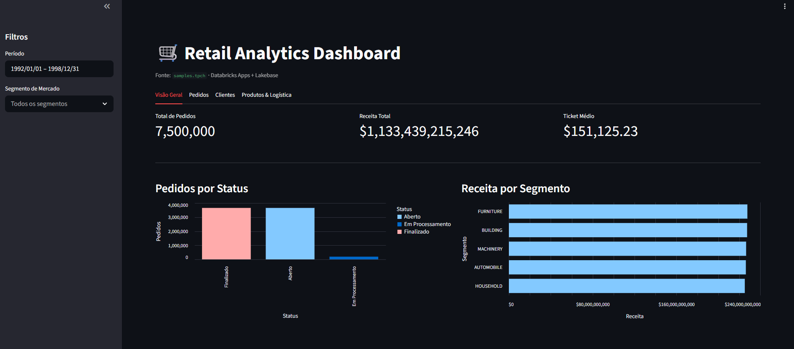
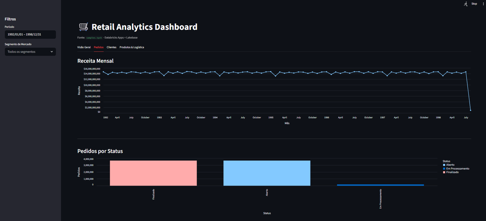
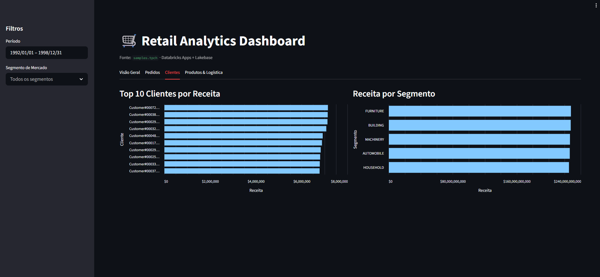
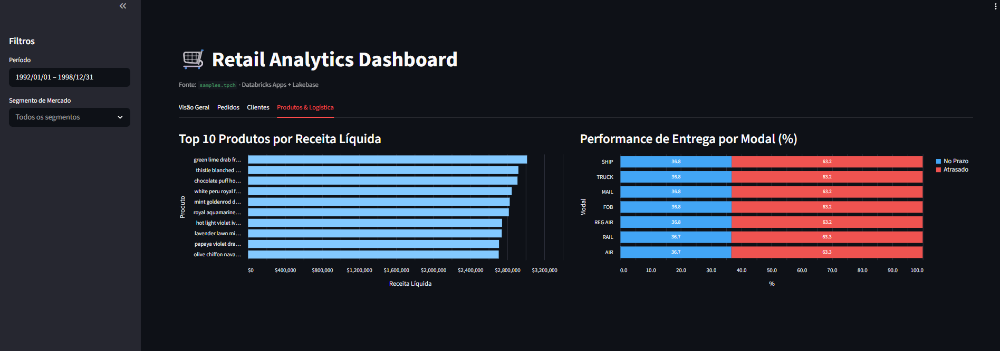
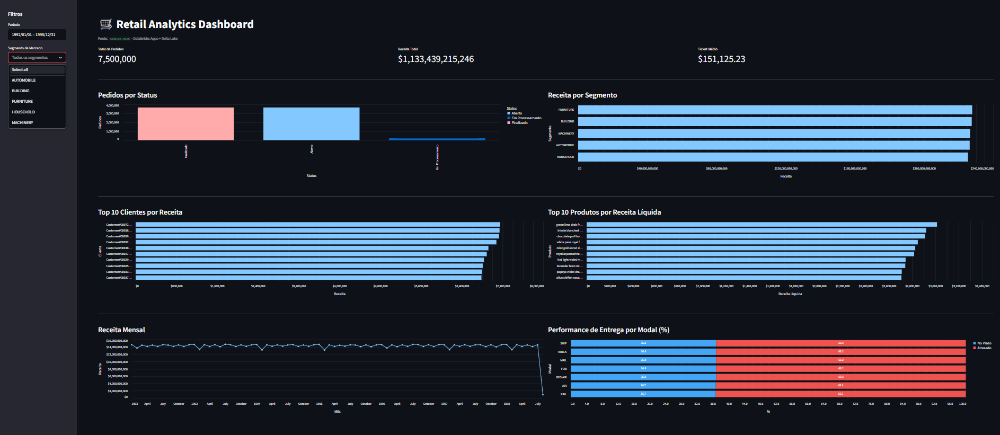
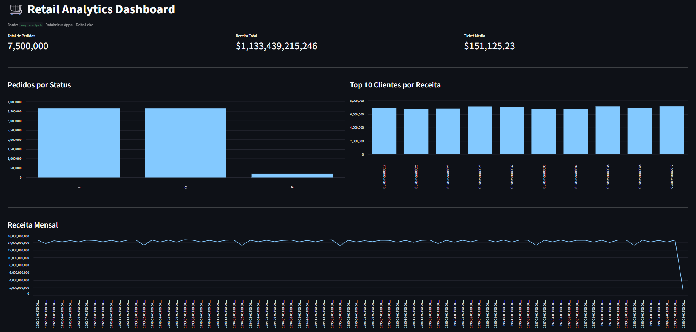

# Changelog — Retail Analytics Dashboard

Histórico de versões com capturas de tela. Versões alinhadas com o plano de estudos de 2 semanas.

---

## v2.0 — Semana 2, Dia 3 (2026-05-27)

**Migração para Lakebase + Deploy por PR automatizado**

### O que mudou

- Backend migrado de SQL Warehouse (Statement Execution API) para **Databricks Lakebase via psycopg2**
- Auth: `generate_database_credential` emite token OAuth ~60 min (substituiu PAT/OBO token)
- Queries com nomes de tabela não qualificados + `search_path=tpch` na conexão (Lakebase não suporta 3-part naming)
- App reestruturado em **4 abas** com navegação (`st.tabs`): Visão Geral, Pedidos, Clientes, Produtos & Logística
- Código separado em módulos: `app.py` · `queries.py` · `charts.py`
- 24 testes unitários (`pytest` + mocks de psycopg2/streamlit/databricks-sdk)
- CI/CD via Bitbucket Pipelines: lint + testes no PR, `bundle deploy` no merge
- `deploy_preview.sh`: ambiente de preview por PR com branch Lakebase copy-on-write, criação automática de role para o SP do app

### Capturas de tela

**Aba Visão Geral** — KPIs, Pedidos por Status, Receita por Segmento

---

**Aba Pedidos** — Receita Mensal (1992–1998) e Pedidos por Status

---

**Aba Clientes** — Top 10 Clientes por Receita e Receita por Segmento

---

**Aba Produtos & Logística** — Top 10 Produtos por Receita Líquida e Performance de Entrega por Modal

---

## v2.1 — Semana 2, Dia 4 (2026-05-28)

### CI desbloqueado + findings do code review

- CI `main → Deploy to dev` desbloqueado: schemas stale (`dev_mesh_dev_sp_dev_ana_cunha` e variantes) removidos por admin via `scripts/cleanup_stale_schemas.sql`
- Code review `/code-review high` com 7 findings identificados (ver `docs/LESSONS_LEARNED.md` — seção "Code Review Assistido por IA"):
  - Bug: `get_kpis` crash com `TypeError` quando filtros retornam zero pedidos (NULL aggregate → `float(None)`)
  - Bug: `get_delivery_performance` filtra por `l_shipdate`; todos os outros gráficos usam `o_orderdate`
  - Bug: `deploy_preview.sh` silencia erros reais de `create-branch` com `|| echo`
  - Segurança: `_segment_clause` monta SQL por interpolação de strings sem parametrização
  - Confiabilidade: falhas do `preview_cleanup.sh` mascaradas no pipeline
  - Performance: todos os 7 queries disparam a cada interação de filtro (sem lazy-load de tabs)
  - UX: date picker em meio de seleção dispara queries com range completo de 7 anos

---

## v1.0 — Semana 1, Dias 2–3 (2026-05-18–19)

**Dashboard funcional com Delta Lake — primeiro deploy**

### O que havia

- Página única com todos os gráficos empilhados verticalmente (sem abas)
- Backend via **SQL Warehouse** (Statement Execution API do Databricks SDK)
- Auth: M2M OAuth via `WorkspaceClient()` com `DATABRICKS_CLIENT_ID` + `DATABRICKS_CLIENT_SECRET`
- Filtros de período e segmento de mercado via sidebar
- Gráficos: KPIs, Pedidos por Status, Receita por Segmento, Top 10 Clientes, Top 10 Produtos, Receita Mensal, Performance de Entrega
- Deploy manual com `databricks bundle deploy --target dev`

### Capturas de tela

**Sidebar com seletor de segmento aberto**

---

**Visão completa da página — todos os gráficos**

